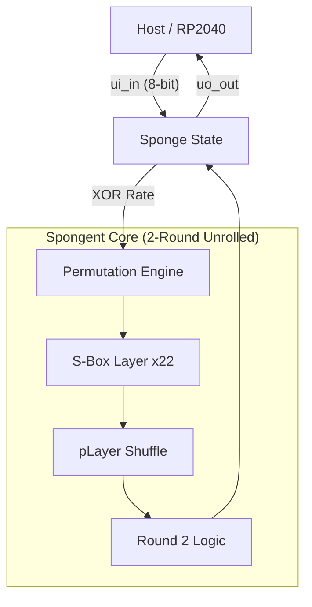

# Spongent-88: Lightweight Post-Quantum Hash Accelerator

[](https://github.com/stefan-aeschbacher/ttihp-spongent88/actions/workflows/test.yaml)
[](https://github.com/stefan-aeschbacher/ttihp-spongent88/actions/workflows/gds.yaml)

A high-performance, gate-efficient silicon implementation of the **Spongent-88/80/8** hash function, designed for the **Tiny Tapeout IHP shuttle**. This chip serves as the cryptographic engine for **Winternitz One-Time Signatures (W-OTS)** — a post-quantum secure signature scheme.

## 🚀 Key Features

*   **2-Round Unrolling:** Computes two permutation rounds per clock cycle, delivering a full 45-round hash in just **23 cycles** (~460ns @ 50MHz).
*   **Post-Quantum Ready:** Optimized as a primitive for W-OTS chain iterations.
*   **Zero-Gate Diffusion:** Leverages hard-wired bit permutations (`pLayer`) for instantaneous, zero-power diffusion.
*   **Sponge Architecture:** Implements a flexible 88-bit state with an 8-bit rate for byte-serial stream processing.
*   **Verified Silicon:** 100% pass rate across cycle-accurate Python reference models and independent cryptographic test vectors.

## 🛠 Architecture

The core uses a **Substitution-Permutation Network (SPN)** architecture:

1.  **Counter Injection:** 6-bit LFSR round constants break symmetry and prevent slide attacks.
2.  **S-Box Layer:** 22 parallel 4-bit Spongent S-boxes provide non-linear confusion.
3.  **pLayer:** A $P(j) = (j \times 22) \pmod{87}$ bit-shuffle provides global diffusion across the 88-bit state.



## 📊 Performance at 50 MHz

| Metric | Value |
| :--- | :--- |
| **Clock Frequency** | 50 MHz |
| **Permutation Latency** | 23 Cycles (460 ns) |
| **Absorption Throughput** | 2.0 MB/s (1 byte / 25 cycles) |
| **W-OTS Signature (375 hashes)** | ~190 µs |

## 🕹 Interface

The chip is controlled via a simple 3-wire register interface (Address, Write-Strobe, Read-Strobe).

| Addr | Register | Command |
| :--- | :--- | :--- |
| **0** | **CMD** | `0` = Reset, `1` = Squeeze, `2` = Hash (Auto-Pad) |
| **1** | **ABSORB** | XORs byte into state and triggers 45-round permutation |
| **2** | **RD_ADV** | Advances the output shift register to the next digest byte |

## 🧪 Verification

The project includes a comprehensive test suite:
*   **`spongent88_ref.py`**: A pure Python implementation used for golden-model verification.
*   **Cocotb Testbench**: Automates RTL simulation vs. reference models.
*   **KAT Validation**: Verified against official Spongent-88 intermediate vectors (`sBoxLayer` and `pLayer` KATs).

To run the simulation locally:
```bash
cd test
make
```

## 📖 Documentation
Detailed signal timing, register maps, and integration guides are available in [docs/info.md](docs/info.md).

## 📄 License

This project is licensed under the **Apache License 2.0**. See the [LICENSE](LICENSE) file for details.

---

## 🏗 Project Context

This project was developed for the **Tiny Tapeout IHP Shuttle** (March 2026). 

*   **Tiny Tapeout** is an educational project that makes it easier and cheaper than ever to get digital and analog designs manufactured on a real chip. Learn more at [tinytapeout.com](https://tinytapeout.com).
*   **Base Template:** This repository is based on the [Tiny Tapeout IHP Verilog Template](https://github.com/TinyTapeout/ttihp-verilog-template).

*Developed by Stefan Aeschbacher.*
